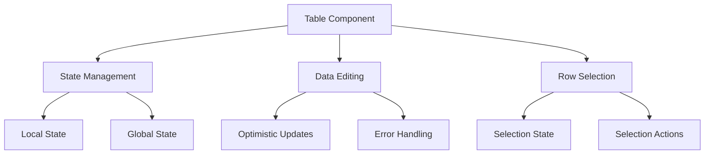
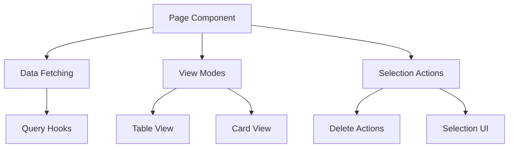
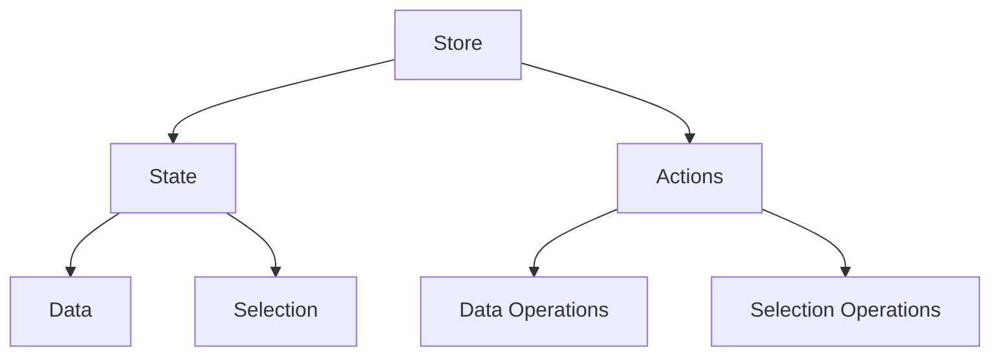
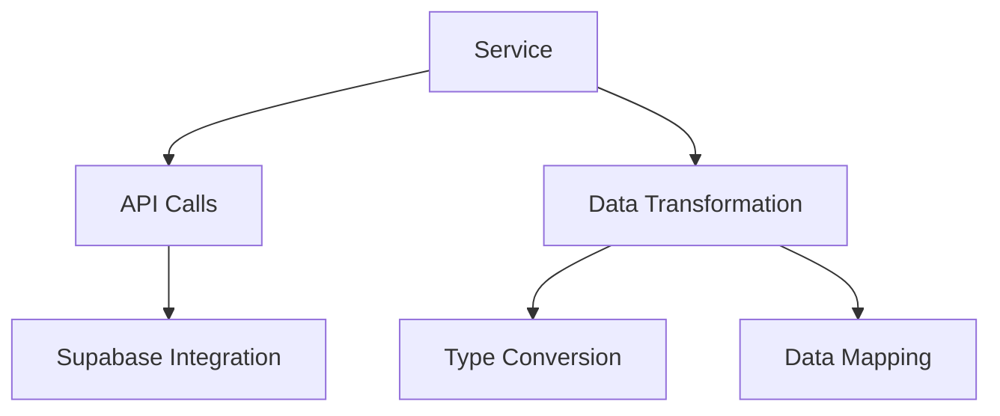
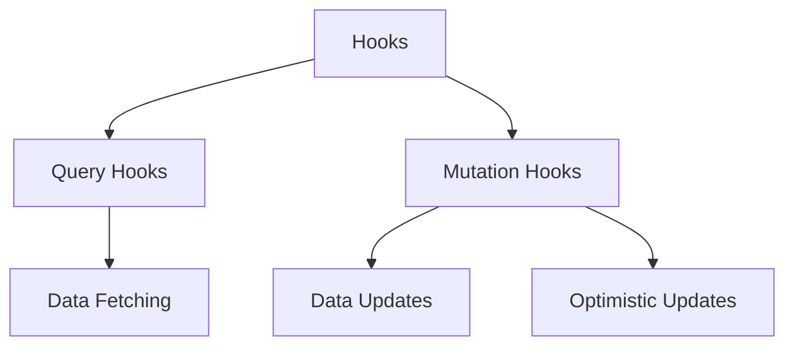

# System Patterns

## Data Management Patterns

### 1. Table Component Pattern (`employee.table.tsx`)

The table component follows a robust pattern for handling editable data tables with selection capabilities:



Key Features:

- Uses `SheetTable` component for editable table functionality
- Implements optimistic updates for better UX
- Handles row selection with global state management
- Supports inline editing with validation
- Manages pending updates state
- Provides error handling and rollback capabilities

### 2. Page Layout Pattern (`index.tsx`)

The page layout follows a consistent pattern for data management pages:



Key Features:

- Supports multiple view modes (table/cards)
- Implements search and filtering
- Handles bulk actions
- Manages selection state
- Provides confirmation dialogs for destructive actions

### 3. Store Pattern (`employees.store.ts`)

The store follows a centralized state management pattern:



Key Features:

- Centralized state management
- Selection state handling
- Data operations (CRUD)
- Error state management
- Loading state management

### 4. Service Layer Pattern (`employeeService.ts`)

The service layer follows a clean separation of concerns:



Key Features:

- API abstraction layer
- Data transformation
- Error handling
- Type safety
- Authentication integration

### 5. Custom Hooks Pattern (`useEmployees.ts`)

The custom hooks follow a consistent pattern for data operations:



Key Features:

- React Query integration
- Optimistic updates
- Error handling
- Cache management
- Type safety

## Selection State Management

### Problem: Infinite Update Loops in Zustand Stores
When implementing selection state in Zustand stores, direct use of `set` can cause infinite update loops when combined with React's state management. This occurs because:
1. The store update triggers a component re-render
2. The re-render causes another store update
3. This cycle continues indefinitely

### Solution: Stable Selection Pattern
Always use this pattern for selection state in Zustand stores:

```typescript
interface Store {
  selectedRows: string[];
  setSelectedRows: (ids: string[]) => void;
  clearSelection: () => void;
}

const useStore = create<Store>((set) => ({
  selectedRows: [],
  
  setSelectedRows: (ids: string[]) => {
    set((state) => {
      // Only update if the selection has actually changed
      if (JSON.stringify(state.selectedRows) === JSON.stringify(ids)) {
        return state;
      }
      return { ...state, selectedRows: ids };
    });
  },
  
  clearSelection: () => {
    set((state) => {
      // Only update if there are actually selected rows
      if (state.selectedRows.length === 0) {
        return state;
      }
      return { ...state, selectedRows: [] };
    });
  },
}));
```

Key points:
1. Use state updater function instead of direct set
2. Compare current and new state before updating
3. Return current state if no change is needed
4. Apply this pattern to ALL selection state implementations

### Implementation Checklist
When implementing selection state:
- [ ] Use state updater function pattern
- [ ] Add comparison check before updates
- [ ] Handle empty state cases
- [ ] Test with multiple rapid selections
- [ ] Verify no infinite loops occur

### Affected Components
This pattern must be used in:
- Quotes store
- Offices store
- Departments store
- Products store
- Any future stores with selection state

## Implementation Guidelines

### When Creating a New Model (e.g., Clients, Products)

1. **Table Component**

   - Create a new table component following `employee.table.tsx` pattern
   - Implement necessary columns and validation
   - Add selection handling
   - Include optimistic updates

2. **Page Layout**

   - Create a new page following `index.tsx` pattern
   - Implement view modes
   - Add search and filtering
   - Include bulk actions

3. **Store**

   - Create a new store following `employees.store.ts` pattern
   - Define state structure
   - Implement actions
   - Add selection handling

4. **Service Layer**

   - Create a new service following `employeeService.ts` pattern
   - Implement API calls
   - Add data transformation
   - Include error handling

5. **Custom Hooks**
   - Create new hooks following `useEmployees.ts` pattern
   - Implement query hooks
   - Add mutation hooks
   - Include optimistic updates

### Key Considerations

1. **Type Safety**

   - Define proper TypeScript interfaces
   - Use strict type checking
   - Implement proper validation

2. **Error Handling**

   - Implement proper error boundaries
   - Add error states
   - Include error messages

3. **Performance**

   - Use proper caching strategies
   - Implement optimistic updates
   - Handle loading states

4. **UX**

   - Provide feedback for actions
   - Handle edge cases
   - Implement proper loading states

5. **Maintainability**
   - Follow consistent patterns
   - Document code
   - Use proper naming conventions
