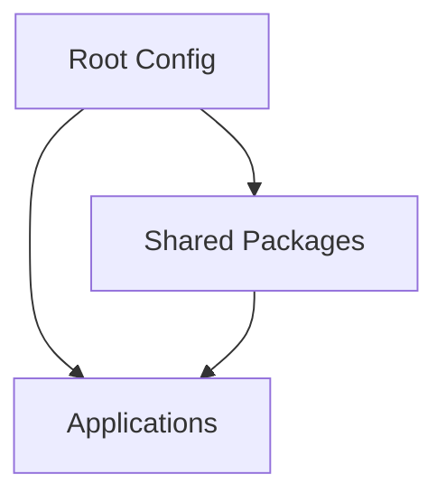

# System Patterns

## Architecture Overview
The project follows a monorepo architecture using Turborepo for build orchestration and workspace management.

## Key Technical Decisions
1. **Monorepo Structure**
   - Separate apps and packages directories
   - Shared configurations and tooling
   - Centralized dependency management

2. **Type Safety**
   - Strict TypeScript configuration
   - Type checking across workspace boundaries
   - Shared type definitions in packages

3. **Build System**
   - Turborepo for intelligent build caching
   - Parallel task execution
   - Optimized dependency graph

## Design Patterns
1. **Workspace Organization**
   - Apps: Individual applications
   - Packages: Shared libraries and utilities
   - Root: Project-wide configuration

2. **Code Quality**
   - Consistent formatting with Prettier
   - TypeScript for type safety
   - Automated linting and type checking

## Component Relationships

Note: This document will be updated as new patterns and architectural decisions are made. 