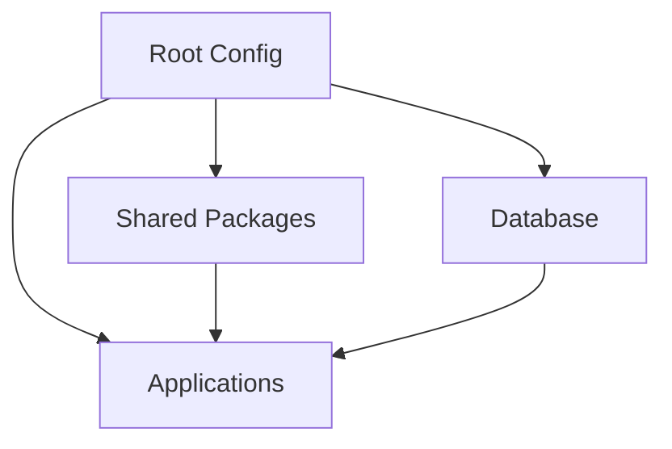

# System Patterns

## Architecture Overview
The project follows a monorepo architecture using Turborepo for build orchestration and workspace management, with Supabase as the backend database and React for frontend applications.

## Key Technical Decisions
1. **Monorepo Structure**
   - Separate apps and packages directories
   - Shared configurations and tooling
   - Centralized dependency management

2. **Type Safety**
   - Strict TypeScript configuration
   - Type checking across workspace boundaries
   - Shared type definitions in packages

3. **Build System**
   - Turborepo for intelligent build caching
   - Parallel task execution
   - Optimized dependency graph

4. **Database Management**
   - Supabase for PostgreSQL database
   - RLS policies in dedicated policies.sql
   - Schema definitions in TypeScript

5. **UI Architecture**
   - React components for UI building blocks
   - Shared component library
   - Consistent styling patterns

## Design Patterns
1. **Workspace Organization**
   - Apps: Individual applications (admin-portal)
   - Packages: Shared libraries and utilities
   - Root: Project-wide configuration
   - DB: Schema and policy management

2. **Code Quality**
   - Consistent formatting with Prettier
   - TypeScript for type safety
   - Automated linting and type checking

3. **Database Patterns**
   - Row Level Security (RLS) policies
   - Type-safe schema definitions
   - Centralized policy management

4. **UI Patterns**
   - Reusable component architecture
   - Consistent page layouts
   - Shared styling system

## Component Relationships

Note: This document will be updated as new patterns and architectural decisions are made. 